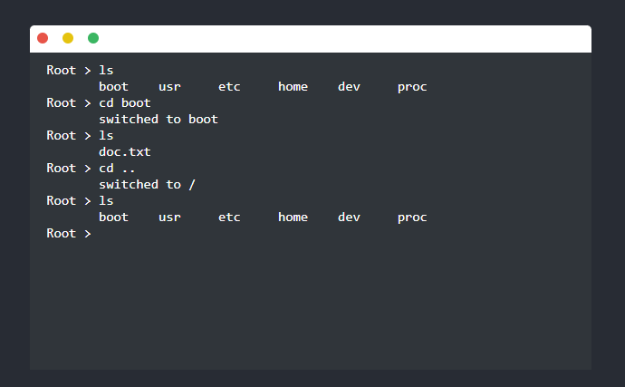
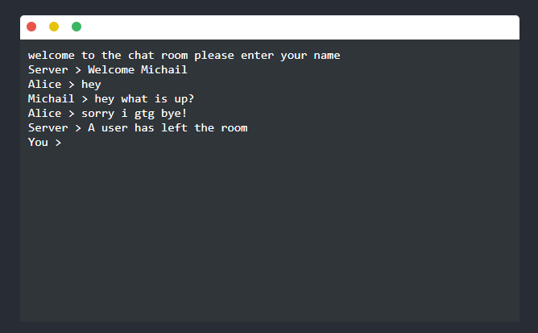

# React CLI Component - Browser Command Line Interface

    

## Introduction

The React CLI Component is a versatile tool that brings the power of a command-line interface to the browser. It allows users to interact with a customizable filesystem and supports communication with a remote server using web sockets. Additionally, it offers a netcat-like chat room feature with multi-user support for real-time chatting.

## Features

- Command-line interface in the browser
- Customizable filesystem using JavaScript object
- Support for communicating with a server using web sockets
- Netcat-like chat room with multi-user support

## Branches

1. **Local Filesystem (master branch)**: This branch runs the CLI component locally and allows users to customize the filesystem using a JavaScript object.

2. **WebSocket Support (addedsockets branch)**: The addedsockets branch enables communication with a remote server via web sockets. The filesystem can still be customized but is now hosted on the remote server. The server repository lies on [basic-server-shell-react-cli](https://github.com/Pervolarakis/basic-server-shell-react-cli).

3. **Netcat-like Chat Room (chatroomcli branch)**: The chatroomcli branch supports a netcat-like chat room functionality using the CLI. It uses sockets for communication and allows multiple users to collaborate in real-time. A separate socket server repository is required for this feature [chat-server-react-cli](https://github.com/Pervolarakis/chat-server-react-cli).

## Installation

To install the React CLI Component, follow these steps:

1. Clone the repository:

`git clone https://github.com/Pervolarakis/react-cli-component.git`
`cd react-cli-component`

2. Install dependencies:

`npm install`

3. After installation, you can use the React CLI Component as follows:

`npm run start`

## Custom Filesystem
In the master branch, you can provide a custom filesystem using a JavaScript object. The object should represent the directory structure with files and directories. The object is located at `src/Commands/directories`

## WebSocket Support
In the addedsockets branch, you can set up communication with a remote server using web sockets. To do so, please refer to [basic-server-shell-react-cli](https://github.com/Pervolarakis/basic-server-shell-react-cli).

## Netcat-like Chat Room

    

The chatroomcli branch offers a netcat-like chat room feature. Users can collaborate using the CLI. However, a separate socket server is required for this functionality. For the socket server setup, please refer to [chat-server-react-cli](https://github.com/Pervolarakis/chat-server-react-cli).

## Contributing
Contributions are welcome! If you find any issues or want to add new features, please feel free to open a pull request or report an issue in the GitHub repository.

## License
This project is licensed under the MIT License.